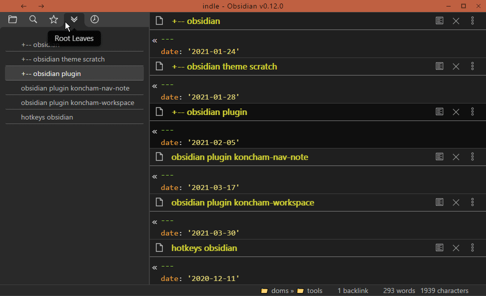

# koncham workspace

an obsidian plugin to enhance the workspace

## features

### `open panes` view (vertical tabs)

This is a tab on the left side-bar that lists all the panes open in the main area.

This works a little like vertical tabs (in vivaldi and edge browsers)

It is useful when using obsidian in ways that some open panes are hidden from view.

examples of such modes include:
+ sliding-panes
+ maximize active pane

(sidebar header icon has been changed from double-downward-arrows to horizontal-bars)

### pin/unpin all leaves

This is useful when you want to force every new note to open in it's own pane

## features planned

+ more functionality in `open panes` view through right click
+ rearrange panes in alphabetical order
+ pane arrangements such as (1+1), (1+2) using commands

## known issues

-- none right now --